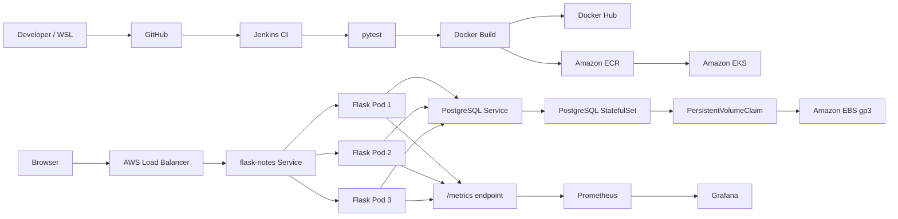

# CloudCart DevOps Project

CloudCart is a small Flask application that I used to learn and demonstrate an end-to-end DevOps workflow: application development, testing, containerization, CI/CD, Kubernetes, AWS EKS, persistent PostgreSQL storage, Prometheus, and Grafana.

The project started as a simple Flask Notes API and evolved into a portfolio-friendly CloudCart UI while keeping the API, database, health checks, tests, and observability layer.

## What this project demonstrates

- Python Flask application with SQLAlchemy
- Automated tests with pytest
- Docker image build
- Docker Compose with PostgreSQL persistence
- Jenkins CI pipeline
- Docker Hub image publishing
- Kubernetes Deployment, Service, ConfigMap, Secret and StatefulSet
- Local Kubernetes testing with kind
- AWS ECR image registry
- Amazon EKS deployment
- 3 Flask replicas with readiness and liveness probes
- PostgreSQL StatefulSet with Amazon EBS gp3 persistent storage
- Public AWS LoadBalancer Service
- Prometheus application metrics
- Grafana dashboards for traffic and latency

## Architecture



For a more detailed explanation, see [docs/architecture.md](docs/architecture.md).

## Application endpoints

| Endpoint | Method | Purpose |
|---|---|---|
| `/` | GET | CloudCart frontend |
| `/notes` | GET | List notes |
| `/notes` | POST | Create a note |
| `/version` | GET | Application version |
| `/metrics` | GET | Prometheus metrics |

Current application version: **v4**

## Prometheus metrics

The Flask app exposes custom metrics including:

- `cloudcart_http_requests_total`
- `cloudcart_http_request_duration_seconds`

Grafana panels created for this project:

- Total Requests
- Request Rate
- Traffic by Endpoint
- P95 Response Time

## Repository structure

```text
.
├── app.py
├── Dockerfile
├── docker-compose.yml
├── Jenkinsfile
├── requirements.txt
├── grafana-values.yaml
├── templates/
│   └── index.html
├── tests/
│   └── test_app.py
├── k8s/
│   ├── configmap.yaml
│   ├── flask-deployment.yaml
│   ├── flask-service.yaml
│   ├── postgres-service.yaml
│   ├── postgres-statefulset.yaml
│   ├── secret.example.yaml
│   └── storageclass.yaml
├── aws/
└── docs/
    ├── architecture.md
    └── linkedin-demo-video.md
```

## Run locally with Python

```bash
python3 -m venv .venv
source .venv/bin/activate
pip install -r requirements.txt
python app.py
```

Open:

```text
http://localhost:5000
```

## Run tests

```bash
python -m pytest -v
```

## Run with Docker Compose

```bash
docker compose up --build
```

The web container connects to PostgreSQL and the database data is stored in a named Docker volume.

Stop the stack:

```bash
docker compose down
```

## Jenkins CI pipeline

The current Jenkins pipeline performs:

```text
Checkout
   ↓
Install Python dependencies
   ↓
Run pytest
   ↓
Build Docker image
   ↓
Push image to Docker Hub
```

The Jenkins pipeline currently publishes to:

```text
vinodjb07/flask-notes-devops
```

For the AWS phase, the application image was also pushed to Amazon ECR and deployed to EKS.

## Kubernetes deployment

The Kubernetes application deployment uses 3 Flask replicas:

```yaml
replicas: 3
```

The current EKS manifest references:

```text
297165774342.dkr.ecr.us-east-1.amazonaws.com/flask-notes-devops:7
```

The Flask container includes readiness and liveness probes on `/notes`.

PostgreSQL runs as a StatefulSet and requests a 1 Gi `gp3` PersistentVolumeClaim.

> The real Kubernetes Secret is intentionally not committed. Use `k8s/secret.example.yaml` as a template.

## AWS deployment

AWS services used during the project:

- Amazon ECR
- Amazon EKS
- EC2 managed worker nodes
- Elastic Load Balancing
- Amazon EBS gp3
- IAM
- EKS EBS CSI Driver

The public application flow was:

```text
Internet
   ↓
AWS Load Balancer
   ↓
Kubernetes Service
   ↓
3 Flask Pods
   ↓
PostgreSQL Service
   ↓
PostgreSQL StatefulSet
   ↓
EBS gp3 Persistent Volume
```

## Monitoring

Prometheus was installed in the `monitoring` namespace using Helm.

Grafana was also installed with Helm, and `grafana-values.yaml` provisions Prometheus as the default data source.

Monitoring flow:

```text
CloudCart /metrics
       ↓
Prometheus
       ↓
Grafana
       ↓
Dashboard
```

## Problems debugged during the project

A major part of this project was troubleshooting real deployment issues, including:

- Python test import issues
- Jenkins Docker access
- GitHub webhook connectivity
- Kubernetes image rollout and rollback
- EKS worker-node pod capacity limits
- EBS CSI IAM policy configuration
- CloudFormation termination protection
- PostgreSQL EBS `lost+found` initialization issue
- PostgreSQL `PGDATA` subdirectory configuration
- Grafana port-forward disconnects after Pod restarts
- Prometheus/Grafana data-source configuration

These were resolved step by step instead of being hidden from the project history.

## Security notes

- Real Kubernetes secrets are excluded from Git.
- `secret.example.yaml` contains placeholder values only.
- Credentials should be managed with Jenkins credentials, Kubernetes Secrets, or a dedicated secrets manager.
- The demo Flask server is suitable for this learning project but should be replaced with a production WSGI server such as Gunicorn for a real production workload.
- The demo public endpoint used HTTP. Production environments should terminate HTTPS with a managed certificate.

## Project evolution

```text
Flask API
   ↓
pytest
   ↓
Docker
   ↓
Docker Compose + PostgreSQL
   ↓
Jenkins CI/CD
   ↓
kind Kubernetes
   ↓
Amazon ECR
   ↓
Amazon EKS
   ↓
EBS persistent storage
   ↓
AWS Load Balancer
   ↓
CloudCart frontend
   ↓
Prometheus
   ↓
Grafana
```
**Vinod**

- GitHub: [iam-vinod7](https://github.com/iam-vinod7)
- LinkedIn: [jb-vinod](https://www.linkedin.com/in/jb-vinod/)
