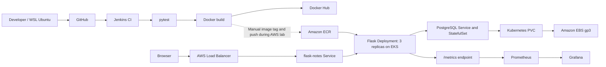

# CloudCart — Flask DevOps Learning Project

CloudCart is a **demo storefront UI and a separate Flask Notes API** used to practise a DevOps workflow: Python testing, Docker, Jenkins, Kubernetes, Amazon EKS, PostgreSQL persistence, and monitoring.

> **Scope:** The product catalogue and cart run in the browser using demo data. The checkout shows a demo confirmation: there is **no payment processing, order API, inventory system, or integration between the storefront cart and PostgreSQL**. The PostgreSQL-backed `/notes` API is the small backend used to test deployment and persistence.

## Architecture



[Architecture details and boundaries](docs/architecture.md).

## What is verifiable in this repository?

| Feature | Evidence in the repository | Scope / limitation |
|---|---|---|
| Flask UI, Notes API and metrics | [app.py](app.py), [templates/index.html](templates/index.html) | Storefront is a front-end demo, not a full e-commerce backend. |
| Automated Python tests | [tests/test_app.py](tests/test_app.py) | Tests cover note creation/listing, version and the metrics endpoint; not end-to-end browser tests or AWS infrastructure. |
| Docker image | [Dockerfile](Dockerfile) | Builds/runs the Flask application. |
| Local PostgreSQL persistence | [docker-compose.yml](docker-compose.yml) | Local development-only example credentials; do not reuse in production. |
| Jenkins CI + Docker Hub push | [Jenkinsfile](Jenkinsfile) | Checkout, dependency installation, pytest, image build and Docker Hub push. **Does not automatically deploy to ECR/EKS.** |
| Kubernetes application deployment | [k8s/](k8s/) | Three replicas, readiness/liveness checks and a LoadBalancer Service. The manifests retain the historical ECR image URI. |
| Kubernetes PostgreSQL storage | [k8s/postgres-statefulset.yaml](k8s/postgres-statefulset.yaml), [k8s/storageclass.yaml](k8s/storageclass.yaml) | 1 Gi EBS gp3 PVC; requires an EKS cluster with EBS CSI configured. |
| Grafana Prometheus data source | [grafana-values.yaml](grafana-values.yaml) | Data source provisioning only; **no exported Grafana dashboard JSON or full monitoring installation values are committed.** |
| AWS cluster / load balancer / monitoring runtime | [Architecture and lab notes](docs/architecture.md) | Deployed and exercised during the lab; **not reproducible end-to-end from this repository alone**. EKS/VPC/IAM infrastructure-as-code is not included. |

Do not interpret the presence of a manifest as proof that its AWS resource is currently running. The AWS environment may have been dismantled after recording the demonstration.

## Quick start

Requires Python 3.12+ and local installation of dependencies.

```bash
python3 -m venv .venv
source .venv/bin/activate
pip install -r requirements.txt
python -m pytest -v
python app.py
```

Visit `http://localhost:5000/`. The local default database is SQLite.

Available endpoints:

| Method | Path | Result |
|---|---|---|
| GET | `/` | CloudCart demo storefront |
| GET | `/notes` | Read notes from the configured database |
| POST | `/notes` | Create a note with JSON such as `{"text":"hello"}` |
| GET | `/version` | Application version |
| GET | `/metrics` | Prometheus-format metrics |

To run Flask and PostgreSQL together locally:

```bash
docker compose up --build
```

Stop with `docker compose down`. The named database volume is preserved unless you explicitly remove it.

## CI/CD: what is and is not automated

The committed [Jenkinsfile](Jenkinsfile) checks out the repository, installs dependencies, runs pytest, builds a Docker image, and pushes a build-number tag plus `latest` to Docker Hub (`vinodjb07/flask-notes-devops`). Docker Hub credentials are configured separately in Jenkins.

**Amazon ECR push and EKS deployment were performed manually during the AWS lab.** They are not Jenkins pipeline stages. The EKS manifest's `:7` image tag refers to that lab image; the repository rename to `cloudcart-devops` does not rename existing image repositories, resource names or Jenkins jobs.

## Kubernetes and AWS lab

[k8s/flask-deployment.yaml](k8s/flask-deployment.yaml) defines three Flask replicas and health probes. [k8s/flask-service.yaml](k8s/flask-service.yaml) requests a public LoadBalancer on port 80. PostgreSQL runs separately as a StatefulSet with a gp3 PVC. The `PGDATA` subdirectory avoids initializing PostgreSQL directly in a filesystem root containing `lost+found`.

The AWS lab also involved ECR, EKS with two worker nodes, IAM, the EBS CSI Driver, an EBS volume, and an AWS Load Balancer. The repository includes **application manifests, not the provisioning scripts for all these services**. To recreate the setup, provision and configure your own cluster, IAM, EBS CSI and credentials first. Do not assume the previous public URL still works.

To configure a local K8s secret, copy [k8s/secret.example.yaml](k8s/secret.example.yaml) to `k8s/secret.yaml`, replace every placeholder with your own values, and keep the real secret out of version control.

## Observability

[app.py](app.py) exports `cloudcart_http_requests_total` and `cloudcart_http_request_duration_seconds` at `/metrics`. During the AWS lab Prometheus scraped the Flask Pods and Grafana was used for request totals, request rate, traffic by endpoint, and P95 latency. [grafana-values.yaml](grafana-values.yaml) provisions Prometheus as a Grafana data source; it does not contain the dashboard panels themselves.

**Metrics caveat:** `/notes` is also used for Kubernetes health probes, so request totals and rates include probe traffic. A Grafana screenshot is a historical observation rather than a guarantee of current availability.

## Notes for interview discussion

This project includes hands-on debugging of Kubernetes pod scheduling limits, rolling updates and rollback, EBS CSI IAM configuration, PostgreSQL's `PGDATA` issue, and Grafana port-forward reconnects. These are **lab experiences**, not claims of production on-call responsibility or a permanently hosted service.

A real production deployment would additionally need a production WSGI server instead of Flask's debug development server, HTTPS, restricted access, managed secrets, automated AWS provisioning, backup/restore, and tighter monitoring/alerting.

**Author:** [Vinod](https://github.com/iam-vinod7) · [LinkedIn](https://www.linkedin.com/in/jb-vinod/)
