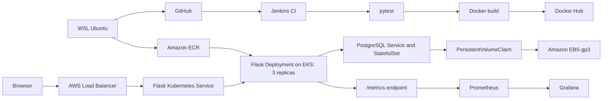

# CloudCart — DevOps Project

CloudCart started as a small Python Flask Notes API and grew into a hands-on project covering containerization, CI, Kubernetes, AWS deployment, persistent storage, and observability. Along the way, I built a storefront-style demo UI and worked through deployment and troubleshooting challenges across local and cloud environments.

The storefront uses a browser-side product catalogue and demo cart. The separate `/notes` API uses SQLAlchemy and PostgreSQL in the containerized deployment.

## Project architecture



See [architecture and implementation notes](docs/architecture.md) for the request flow, storage, monitoring, and issues encountered.

## Technologies and implementation

| Area | What I built | Project files |
|---|---|---|
| Application | Flask API, demo storefront, SQLAlchemy database connection and metrics endpoint | [app.py](app.py), [templates/index.html](templates/index.html) |
| Testing | pytest tests for creating and reading notes, application version, and metrics | [tests/test_app.py](tests/test_app.py) |
| Containers | Flask Docker image and local Flask + PostgreSQL Compose stack with named-volume persistence | [Dockerfile](Dockerfile), [docker-compose.yml](docker-compose.yml) |
| CI | Jenkins pipeline for checkout, dependencies, tests, Docker image build, and Docker Hub push | [Jenkinsfile](Jenkinsfile) |
| Kubernetes | Three Flask replicas, health probes, Service, ConfigMap, and Secret example | [k8s/](k8s/) |
| Database storage | PostgreSQL StatefulSet, headless Service, 1 Gi PVC using an EBS gp3 StorageClass | [k8s/postgres-statefulset.yaml](k8s/postgres-statefulset.yaml), [k8s/storageclass.yaml](k8s/storageclass.yaml) |
| Observability | Prometheus request/latency metrics and Grafana with a provisioned Prometheus data source | [app.py](app.py), [grafana-values.yaml](grafana-values.yaml) |

## Build journey

### 1. Flask application and local testing

Created the `GET /notes` and `POST /notes` API, a `/version` endpoint, and automated tests using an in-memory SQLite database. Added the CloudCart storefront at `/`.

### 2. Docker and PostgreSQL

Built the Flask image and connected it to PostgreSQL using Docker Compose. Used a named volume and checked that notes remained after containers restarted.

### 3. Jenkins pipeline

Configured Jenkins to check out the repository, install Python dependencies, run pytest, build the container image, and publish build-number and `latest` tags to Docker Hub.

**CI — Continuous Integration:** Built a Jenkins CI/CD workflow to integrate code changes, run automated Python tests, build Docker images, and publish versioned images to Docker Hub.

**CD — Deployment:** Pushed the application image to Amazon ECR and deployed it to Amazon EKS with three replicas. Performed rolling updates, verified Pod health, monitored deployment status, and tested rollback.

### 4. Kubernetes with kind

Deployed Flask and PostgreSQL to a local kind cluster. Worked with Services, ConfigMaps, Secrets, a StatefulSet, persistent storage, three application replicas, Pod self-healing, rolling updates, and rollback.

### 5. AWS deployment

Pushed an application image to Amazon ECR and deployed it on Amazon EKS. Configured the EBS CSI Driver and gp3 storage for PostgreSQL, scaled the node group to accommodate three Flask replicas, and exposed the application through an AWS Load Balancer. The application and its database ran as separate Kubernetes workloads.

### 6. Prometheus and Grafana

Added a Prometheus request counter and request-duration histogram at `/metrics`. Installed Prometheus and Grafana with Helm and built panels for total requests, request rate, traffic by endpoint, and P95 latency. The `/notes` health probes also contribute to the request metrics.

## Problems solved along the way

| Challenge | Investigation and fix |
|---|---|
| Jenkins port 8080 was already occupied | Ran Jenkins on host port 8081. |
| Kubernetes application image update failed | Inspected the rollout and image state, then tested rollback before applying a valid image tag. |
| Some Flask Pods remained Pending on EKS | `kubectl describe pod` showed `Too many pods`; scaled from one to two worker nodes. |
| EBS CSI IAM configuration failed | Corrected the IAM policy ARN and recovered from the failed CloudFormation stack before installing the driver. |
| PostgreSQL failed to initialize on EBS | Traced initialization to the volume's `lost+found` directory; set `PGDATA=/var/lib/postgresql/data/pgdata`. |
| Grafana disconnected after a Helm upgrade | Checked Pod health and restarted the port-forward to the new Grafana Pod. |
| Grafana data-source UI could not fetch configuration | Provisioned the Prometheus data source using [grafana-values.yaml](grafana-values.yaml). |

## Run locally

With Python 3.12+:

```bash
python3 -m venv .venv
source .venv/bin/activate
pip install -r requirements.txt
python -m pytest -v
python app.py
```

Open `http://localhost:5000/`. The application uses SQLite locally unless `DATABASE_URL` is set.

For the Docker Compose stack with PostgreSQL:

```bash
docker compose up --build
```

Visit `http://localhost:5000/`; run `docker compose down` to stop the stack without deleting its named database volume. The Compose credentials are for local demonstration.

### Application endpoints

| Method | Path | Purpose |
|---|---|---|
| GET | `/` | CloudCart demo storefront |
| GET | `/notes` | Read notes |
| POST | `/notes` | Create a note with JSON, e.g. `{"text":"hello"}` |
| GET | `/version` | App version |
| GET | `/metrics` | Prometheus metrics |

The cart and checkout are browser-side demo interactions; the PostgreSQL-backed Notes API is independent of the storefront.

## Repository resources

- [Jenkins pipeline](Jenkinsfile)
- [Kubernetes manifests](k8s/)
- [Architecture and implementation notes](docs/architecture.md)
- [Grafana Helm configuration](grafana-values.yaml)

To use the Kubernetes Secret example, copy `k8s/secret.example.yaml` to the ignored `k8s/secret.yaml`, set your own values, and keep actual credentials out of Git.

---

Built by [Vinod](https://github.com/iam-vinod7) · [LinkedIn](https://www.linkedin.com/in/jb-vinod/)
