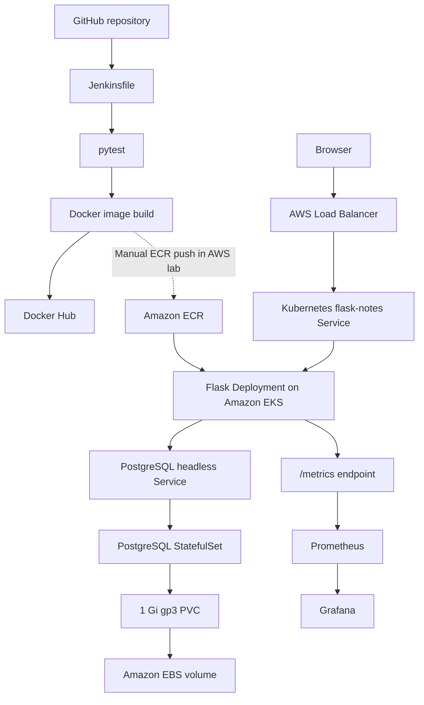

# CloudCart architecture and implementation boundaries

## Application

CloudCart has two different demo surfaces: a static product catalogue/cart rendered by `templates/index.html`, and Flask's independent `/notes` API backed by SQLAlchemy. The catalogue, cart, and demo checkout are browser-side only. There is no product/order database or actual payment path. PostgreSQL persists **notes**, not shopping transactions.

## CI and deployment

The **committed Jenkinsfile ends at Docker Hub push**. In the AWS lab an image was separately tagged and pushed to ECR, then the Kubernetes deployment image was updated manually. The diagrams show the lab's runtime flow, **not a fully automated Jenkins-to-EKS release pipeline**.

## Evidence and limitations

| Component | Committed artifact | Boundary |
|---|---|---|
| Flask/SQLAlchemy API + metrics | `app.py` | Notes DB; storefront cart is not backed by PostgreSQL. |
| Browser demo | `templates/index.html` | Products/cart/checkout are simulated; no real orders or payments. |
| Tests | `tests/test_app.py` | Unit/API tests only. |
| Local container and DB | `Dockerfile`, `docker-compose.yml` | Compose uses local demo DB credentials. |
| CI build and publish | `Jenkinsfile` | Docker Hub push only. |
| EKS application layout | `k8s/flask-deployment.yaml`, `k8s/flask-service.yaml` | Three replicas and health probes; cluster provisioning not included. |
| PostgreSQL persistent storage | `k8s/postgres-statefulset.yaml`, `k8s/storageclass.yaml` | Needs EBS CSI and IAM configured on the cluster. |
| Grafana datasource | `grafana-values.yaml` | Grafana dashboard JSON and complete Helm install configuration are not committed. |

## Troubleshooting practised during the lab

- **Scheduling:** One `t3.small` node ran into a `Too many pods` scheduling condition; adding a second worker let three application replicas schedule.
- **Persistent storage:** PostgreSQL initialization failed when the EBS filesystem's root contained `lost+found`; setting `PGDATA=/var/lib/postgresql/data/pgdata` resolved it. This setting remains in the StatefulSet manifest.
- **Rolling releases:** Tested a new container image rollout and rollback.
- **EBS CSI:** Installed the driver after correcting an IAM policy ARN and resolving a failed CloudFormation stack.
- **Monitoring:** Prometheus targets were observed `UP`; Grafana was configured with Prometheus as a data source. The port-forward had to be restarted after a Grafana Pod rollout.

These are historical hands-on lab results. Infrastructure may have been removed to stop cloud charges; this repository does not claim a continuously running public service.

## Important deployment/security boundaries

The demonstration used an HTTP LoadBalancer and Flask's development server with debug enabled. It is not production hardened. The committed Kubernetes secret file is a **placeholder example**; real secrets must remain untracked. No complete IaC for the VPC/EKS/IAM resources, automated EKS rollout, Grafana dashboard export, TLS setup, or production order/payment processing is included.
