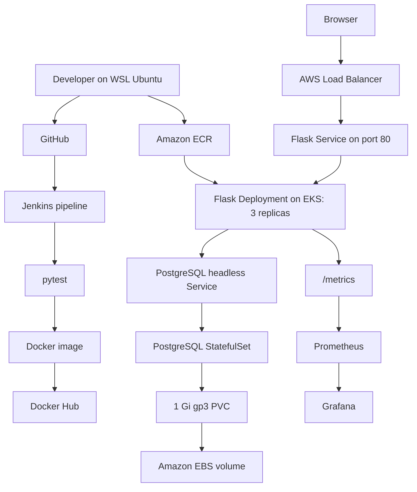

# CloudCart architecture and implementation

CloudCart combines a Flask-based Notes API and demo storefront with a containerized DevOps workflow. The browser-side catalogue/cart is separate from the SQLAlchemy Notes API. PostgreSQL persists notes.

## Architecture

## Application and testing

- `app.py` contains the Flask application, SQLAlchemy Notes model, API endpoints, and Prometheus request counter and latency histogram.
- `templates/index.html` contains the demo storefront with browser-side product filtering, cart, and checkout confirmation.
- `tests/test_app.py` runs Flask API tests against an in-memory SQLite database.

## Containers and CI

- The `Dockerfile` builds the Python application image.
- `docker-compose.yml` runs Flask with PostgreSQL and a named data volume for local development.
- The `Jenkinsfile` runs checkout, dependency installation, pytest, image build, and Docker Hub publishing.
- During the AWS phase, the application image was pushed to ECR and deployed to EKS.

## Kubernetes and AWS

The Flask Deployment runs three replicas with readiness and liveness checks on `/notes`. A LoadBalancer Service routes port 80 to Flask port 5000. PostgreSQL runs behind a headless Service as a StatefulSet using a gp3 PersistentVolumeClaim provisioned through the Amazon EBS CSI Driver.

The EKS node group initially had one `t3.small` worker. Two application Pods remained Pending; `kubectl describe pod` showed `Too many pods`. Scaling to two workers allowed all three Flask replicas to run.

PostgreSQL initially failed to initialize because the mounted EBS filesystem contained `lost+found`. Setting `PGDATA=/var/lib/postgresql/data/pgdata` resolved initialization, and the data remained available after recreating the PostgreSQL Pod.

For a cluster deployment, provide the ConfigMap and a real Kubernetes Secret using `k8s/secret.example.yaml` as a template. The example contains placeholders.

## Monitoring

The application exports `cloudcart_http_requests_total` and `cloudcart_http_request_duration_seconds` at `/metrics`. Prometheus scraped the CloudCart Pods in EKS; Grafana used Prometheus as a data source and visualized total requests, request rate, endpoint traffic, and P95 response time.

`grafana-values.yaml` stores the Helm data-source configuration. The `/notes` health probes are included in the HTTP request metrics.

## Debugging log

| Issue | Action |
|---|---|
| Port conflict during Jenkins installation | Mapped the Jenkins container to host port 8081. |
| Kubernetes image rollout failure | Reviewed the rollout, tested rollback, then deployed the correct image tag. |
| EKS Pod scheduling capacity | Identified the `Too many pods` event and scaled the worker node group. |
| EBS CSI permissions | Corrected the IAM policy ARN and resolved the failed CloudFormation stack. |
| PostgreSQL initialization on EBS | Changed `PGDATA` to a subdirectory of the mounted volume. |
| Grafana port-forward lost connection | Checked the Grafana Pod after Helm rollout and started a fresh port-forward. |
| Grafana Prometheus data-source setup | Provisioned the data source using Helm values. |

The AWS deployment was a time-bounded hands-on environment; the application can also be run locally with Python or Docker Compose. Deployment configuration remains in `k8s/` for reference and reuse.
