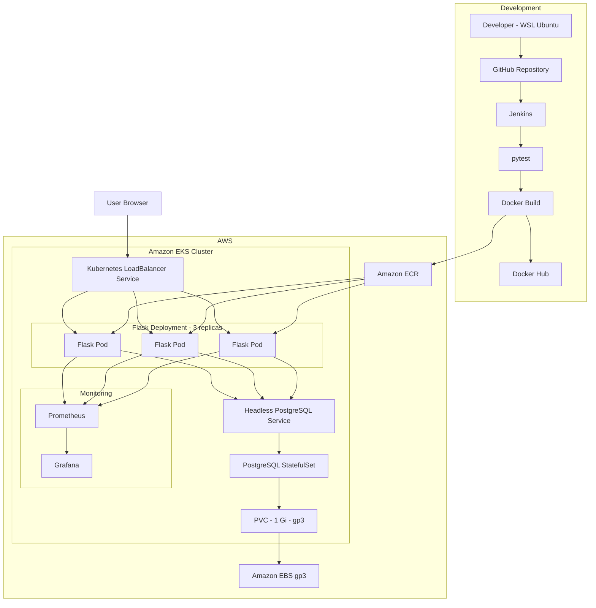

# CloudCart Project Architecture

## 1. Overview

CloudCart is a Flask-based learning project deployed as a containerized application on Amazon EKS. It uses PostgreSQL for persistent data, Amazon EBS for Kubernetes storage, an AWS Load Balancer for public access, and Prometheus plus Grafana for observability.

## 2. High-level architecture



## 3. CI flow

The Jenkins pipeline currently implements:

```text
GitHub
  ↓
Jenkins Checkout
  ↓
Create Python virtual environment
  ↓
Install requirements
  ↓
pytest
  ↓
docker build
  ↓
Docker Hub
```

Jenkins uses its credentials store for Docker Hub authentication.

The AWS deployment image was separately pushed to Amazon ECR for EKS.

## 4. Runtime request flow

```text
Browser
  ↓
AWS Load Balancer
  ↓
flask-notes Kubernetes Service :80
  ↓
Flask Pod :5000
  ↓
PostgreSQL Service :5432
  ↓
PostgreSQL StatefulSet
```

The Service distributes application requests across 3 Flask replicas.

## 5. Application layer

The application is implemented with:

- Flask
- Flask-SQLAlchemy
- psycopg
- Prometheus Python client

Important endpoints:

| Route | Function |
|---|---|
| `/` | CloudCart web UI |
| `GET /notes` | Read stored notes |
| `POST /notes` | Create a note |
| `GET /version` | Return current app version |
| `GET /metrics` | Export Prometheus metrics |

## 6. Kubernetes layer

### Flask Deployment

- 3 replicas
- ECR image `:7`
- port 5000
- ConfigMap and Secret via `envFrom`
- readiness probe
- liveness probe

### Flask Service

- type: `LoadBalancer`
- public port: 80
- target port: 5000

### PostgreSQL

PostgreSQL runs as a StatefulSet because database storage must persist independently from the Pod lifecycle.

The headless PostgreSQL Service provides stable in-cluster service discovery.

## 7. Persistent storage

The PostgreSQL StatefulSet requests:

```text
1 Gi
ReadWriteOnce
StorageClass: gp3
```

The `gp3` StorageClass uses:

```text
provisioner: ebs.csi.aws.com
```

The Amazon EBS CSI Driver dynamically provisions the backing EBS volume.

### PGDATA fix

When PostgreSQL was first mounted on the EBS filesystem, initialization encountered the filesystem-created `lost+found` directory.

The StatefulSet was fixed by using:

```text
PGDATA=/var/lib/postgresql/data/pgdata
```

This stores PostgreSQL data in a clean subdirectory of the mounted volume.

## 8. EKS scaling lesson

With a single `t3.small` worker node, some Flask replicas remained Pending.

`kubectl describe pod` showed a `Too many pods` scheduling condition.

The managed node group was scaled to 2 worker nodes, after which all 3 Flask replicas scheduled successfully.

## 9. Observability

The application exports:

```text
cloudcart_http_requests_total
cloudcart_http_request_duration_seconds
```

Prometheus scrapes the Flask Service at `/metrics`.

Grafana uses Prometheus as its default data source.

Dashboard panels:

1. Total Requests
2. Request Rate
3. Traffic by Endpoint
4. P95 Response Time

## 10. Reliability features

The project demonstrates:

- multiple application replicas
- Kubernetes self-healing
- rolling updates
- rollback testing
- readiness probes
- liveness probes
- persistent database storage
- metrics monitoring

## 11. Secrets

The real `k8s/secret.yaml` is intentionally excluded from version control.

Only `k8s/secret.example.yaml` is committed.

## 12. Current limitations

This is a learning/portfolio project, not a hardened production platform.

Production improvements would include:

- Gunicorn instead of Flask development server
- HTTPS/TLS
- private database network controls
- AWS Secrets Manager or External Secrets
- Terraform-managed EKS infrastructure
- autoscaling
- alerting
- backup and restore strategy
- fully automated Jenkins-to-ECR/EKS deployment
